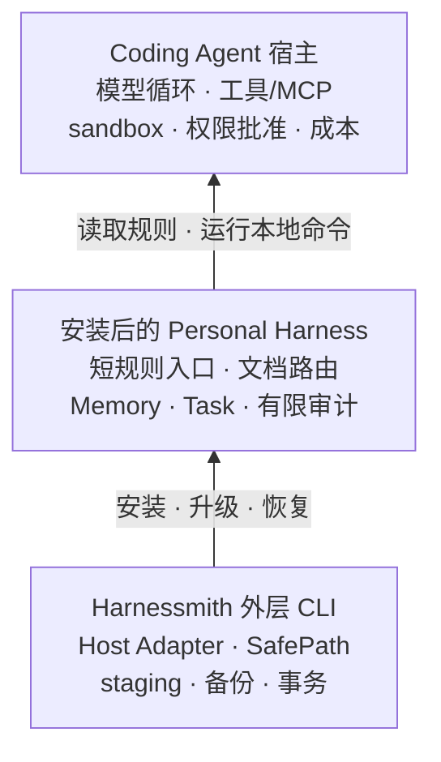

# Harnessmith 架构设计

Harnessmith 是**跨 Host 的 Personal Harness 分发与工作状态控制层**。它把一套宿主中立的规则、文档和本地 Runtime
安全地接入 Codex、Cursor、Claude Code、OpenCode、Kimi Code CLI、DeepSeek Harness 与 WorkBuddy，但不替代这些宿主的 Agent
Runtime。

公开能力始终分成三种状态：**已实现（Implemented）** 表示代码与可执行证据都存在；**由宿主负责（Delegated to the
Host）** 表示 Harnessmith 只提供 guidance 或接入点；**不支持（Unsupported）** 表示当前明确不声称拥有。逐项 owner
和证据路径见[能力声明—证据矩阵](./capability-evidence.yaml)。

## 先记住一个模型

上层宿主负责“Agent 怎样运行”，中间 Harness 负责“Agent 怎样找到并延续你的工作方式”，外层 CLI 负责“这套工作方式
怎样安全进入不同宿主”。理解这三层，基本就能判断一项能力属于谁。

## 为什么分成两层

外层 `src/` 必须知道 Codex Home、Cursor 项目目录、Claude 配置目录等宿主事实，也必须处理安装事务。内层
`template/agent-harness/` 则应该保持宿主中立，才能在不同 Agent 中复用同一套文档、Memory 和 Task 契约。

如果把宿主路径写进模板，每增加一个宿主都会污染核心；如果让 Adapter 复制一整套业务逻辑，不同宿主又会迅速漂移。
因此项目规则明确要求：**宿主身份、路径和环境变量留在 Adapter，通用 Harness 能力留在分发模板。**

## 四个实现平面

### 1. Distribution：把 Harness 安全送到目标位置

外层 `src/` 包含 CLI、Adapter、安全路径、操作锁、staging、备份、安装记录以及 restore/uninstall 事务。一次多宿主操作
会先完整预检所有 Adapter，再开始写入；中途失败时按已提交步骤逆序回滚，避免出现半完成状态。

### 2. Guidance & Context：让 Agent 找到合适信息

`template/AGENTS.md` 是短入口，只保留高损失边界和发现顺序。详细内容位于 `template/agent-harness/docs/`，由
manifest、route 和 search 按任务发现。项目内更具体的规则、skill、代码和测试仍优先于通用个人规则。

用户所有的 Personal overlay 还维护 Repository Map：以有类型的直接关系连接 provider、contract 和 consumer，并用两侧
权威来源约束写入。它帮助跨仓任务定位 owner 与影响面，但不替代项目架构文档、实时拓扑或部署状态。

这层提供 guidance，不提供 enforcement。Agent 是否遵循自然语言规则仍受模型和宿主影响；真正必须成立的约束要落到
代码、schema、测试、CI 或宿主权限系统。

### 3. Work State：跨会话保存线索与任务契约

内嵌 Runtime 在项目 `.agent-docs/` 中维护非权威 Memory 和 Task ledger。Memory 用于重新发现经验；Task 记录目标、
状态、检查点、下一步、验收条件和证据。并发写入持有任务锁，`complete` 只能通过 acceptance gate。

这层刻意不自动把 Memory 提升成规则或源码。可持续学习需要提案、核对和明确写入目标，避免历史推断污染事实源。

### 4. Verification：区分可重复门禁与真实宿主证据

tests、schema、preflight、覆盖率与包检查验证仓库内确定性契约。完整的 Host Eval 应把真实宿主运行得到的工具、文件和
verifier 证据绑定到精确候选 tarball；仓库中的 `eval:validate` 与 `eval:gate` 只负责检查记录结构、覆盖与 release policy。

`eval:gate` 是 executable release gate，但它只校验 maintainer-attested record structure 的候选绑定、结构、一致性与
覆盖。它不会启动第三方宿主，也不负责登录或认证，更不能证明记录确由真实 Host 产生；可信来源需要
外部 CI、签名 attestation 和人工复核。详见[证据与评测](/concepts/evidence-and-evaluation)。

## 一次安装的事务边界

有副作用的生命周期操作共享同一套安全骨架：

1. canonicalize 用户选择的 Agent home 或项目根；
2. 校验 output、record、backup 与 ignore path 的 lexical containment；
3. 对授权根和现存路径段执行 `lstat`，默认拒绝 symlink、junction 与 reparse path；
4. 按稳定路径顺序获取跨进程 operation lock；
5. 在授权根内 staging payload，校验生成结果；
6. commit 前全量复检，每次 mkdir、rename 或 write 前再检查直接目标；
7. 失败时只回滚本次记录的精确路径。

Node.js 不能提供所有平台上等同于 `openat(O_NOFOLLOW)` 的原子语义，所以 TOCTOU 防护是“锁 + 反复复检”的 best
effort，而不是绝对安全声明。检测到路径替换时会 fail closed。

## Adapter 契约

`src/adapter-registry.ts` 是宿主身份与 capability 的单一清单；`createAdapter()` 解析路径后挂上同一
份 `capabilities`，并出现在 dry-run、install result 与 status JSON 中。CLI `all` 展开、交互选择、
capabilities 输出与 Eval `host.adapter` 枚举都从该清单派生或与之对齐。`evals/run.schema.json` 的
`host.adapter.enum` 是由 registry 生成的已提交产物：新增内置 Adapter 时先登记 registry，再补
`src/adapters.ts` 路径解析，并运行 `pnpm run eval:schema:generate`；preflight / `eval:schema:check`
拒绝生成物漂移。共享生命周期由 `adapter-conformance` 套件覆盖，不引入动态插件加载。

| Adapter | 范围 | 规则入口 | 原生激活 | 权限 owner |
| --- | --- | --- | --- | --- |
| Codex | global | Markdown | host-default | host |
| Claude Code | global | Markdown | host-default | host |
| OpenCode | global | Markdown | host-default | host |
| Kimi Code CLI | global | Markdown | host-default | host |
| DeepSeek Harness | global | Markdown | host-default | host |
| WorkBuddy | global | Markdown | host-default | host |
| Cursor | project | AGENTS.md + MDC | MDC always | host |

“支持”表示 Adapter 生命周期、能力描述和回归测试存在，不表示每个宿主版本都完成真实运行评测。逐项状态以
[能力声明—证据矩阵](./capability-evidence.yaml)为准。

### DeepSeek Harness 契约来源与验证边界

产品身份（官方坐标）：仓库
[deepseek-ai/deepseek-harness](https://github.com/deepseek-ai/deepseek-harness)，npm 包 `@deepseek-ai/dsh`，可执行文件
`dsh`。配置根为 `$DSH_HOME`（默认 `~/.dsh`）；空或仅空白的 `DSH_HOME` 按上游 `resolveDshHome` 视为未设置。用户全局
指令契约来自 `@deepseek-ai/dsh-agent-instructions`（`packages/context/agent-instructions`）。

#### 验证 revision（maintainer 手工 + 自动化安装生命周期）

| 坐标 | 已验证值 |
| --- | --- |
| npm CLI | `@deepseek-ai/dsh@0.1.1-rc.2` |
| npm 指令契约 | `@deepseek-ai/dsh-agent-instructions@0.1.1-rc.2`（与上述 CLI 同版本捆绑） |
| 上游 Git tag | [`dsh-v0.1.1-rc.2`](https://github.com/deepseek-ai/deepseek-harness/releases/tag/dsh-v0.1.1-rc.2) |
| 上游 commit | `b150a551b8d465e31e418e1b2eaf5e79bbb7d28e` |

#### 支持范围

DeepSeek Harness 仍处于 developer preview，版本间可能 breaking change。Harnessmith 的 Adapter
安装生命周期（路径解析、备份、restore/uninstall）面向文档化的 `$DSH_HOME/AGENTS.md` 契约，但**兼容性声明仅覆盖上表
这一组 npm 版本 + 上游 revision 的验证结果**；更高/更低或其他 revision 的 `dsh` 在重新验证前不视为已支持。Host Eval
仍为非阻断可选证据。

**不要把 Adapter 契约等同于「写一个全局 Markdown 文件」。** 产品身份与指令加载是两件事：DSH 会话 baseline 是一条
作用域链，而 Harnessmith 只托管其中固定的用户全局一层。

| 范围 | 谁负责 | 说明 |
| --- | --- | --- |
| 用户全局 `$DSH_HOME/AGENTS.md` | Harnessmith Adapter | 唯一安装的指令入口；同根下还有 `agent-harness/`、`.harnessmith/` |
| 项目根 / 嵌套 `AGENTS.md`、`CLAUDE.md` 与 `.local` overlay | 宿主 / 工作区 | 按 Session `cwd`、根标记与候选列表加载；**不在**安装范围 |
| 权限、sandbox、工具白名单、审批 | 宿主 Runtime | 指令文件仅为 advisory，安装成功不等于强制执行 |
| Cordis patch、`settings.yaml`、凭证 | 宿主 / 用户 | Harnessmith **不**写入、不挂载插件 |

| 状态 | DeepSeek 边界 |
| --- | --- |
| 已实现（Implemented） | 用户全局路径解析、`install --dry-run` / `install` / `status` / `restore` / `uninstall`、SafePath、锁、备份、所有权标记与回滚；**不**声称托管完整作用域链 |
| 已在真实宿主验证（Verified on Host） | 尚未提交 maintainer-attested DeepSeek Host Eval；文件存在 ≠ 已验证 Session baseline 注入；发布门禁仍只要求 Codex |
| 由宿主负责（Delegated to the Host） | 项目/嵌套指令发现、模型循环、工具/权限/sandbox/审批、profile/bundle、会话存储与凭证 |

### WorkBuddy 契约来源与验证边界

产品身份：腾讯 WorkBuddy 与腾讯云代码助手 CodeBuddy 共用 CodeBuddy 引擎。CLI 坐标为 npm 包
`@tencent-ai/codebuddy-code`，可执行文件 `codebuddy`。配置根为 `$CODEBUDDY_CONFIG_DIR`（默认 `~/.codebuddy`）；
空或仅空白的 `CODEBUDDY_CONFIG_DIR` 视为未设置。用户全局指令入口为 `CODEBUDDY.md`。官方规定：项目根若已存在
`CODEBUDDY.md`，则不再加载 `AGENTS.md`。

契约来源：

- 安装与配置根：<https://www.codebuddy.ai/docs/cli/installation>
- 目录与记忆加载顺序：<https://www.workbuddy.ai/docs/zh/cli/codebuddy-dir>
- 规则与 `AGENTS.md` 兼容：<https://www.workbuddy.cn/docs/ide/User-guide/Rules>

**不要把 Adapter 契约等同于「写一个全局 Markdown 文件」。** WorkBuddy/CodeBuddy 还有用户级 `rules/`、项目
`.codebuddy/`、`settings.json` 与 MCP；Harnessmith 只托管用户全局 `CODEBUDDY.md`。

| 范围 | 谁负责 | 说明 |
| --- | --- | --- |
| 用户全局 `$CODEBUDDY_CONFIG_DIR/CODEBUDDY.md` | Harnessmith Adapter | 唯一安装的指令入口；同根下还有 `agent-harness/`、`.harnessmith/` |
| 项目 `.codebuddy/`、`CODEBUDDY.md` / `CODEBUDDY.local.md`、`rules/` | 宿主 / 工作区 | 按官方记忆加载顺序生效；**不在**安装范围 |
| 权限、sandbox、工具白名单、审批 | 宿主 Runtime | 指令文件仅为 advisory，安装成功不等于强制执行 |
| `settings.json`、MCP、凭证 | 宿主 / 用户 | Harnessmith **不**写入 |

与 CodeBuddy CLI 共存时，官方建议用独立 `CODEBUDDY_CONFIG_DIR` 避免争用默认 `~/.codebuddy`。Adapter 尊重该环境变量，
但不猜测 WorkBuddy 桌面端是否另有默认根。

| 状态 | WorkBuddy 边界 |
| --- | --- |
| 已实现（Implemented） | 用户全局路径解析、`install --dry-run` / `install` / `status` / `restore` / `uninstall`、SafePath、锁、备份、所有权标记与回滚 |
| 已在真实宿主验证（Verified on Host） | 尚未提交 maintainer-attested WorkBuddy Host Eval；文件存在 ≠ 已验证会话注入；发布门禁仍只要求 Codex |
| 由宿主负责（Delegated to the Host） | 项目规则/技能/子代理、模型循环、工具/权限/sandbox/审批、会话存储与凭证 |

## 数据与信任边界

- 个人 overlay、可变 `state/`、受管理模板和项目 `.agent-docs/` 分开存放，避免升级覆盖用户内容。
- audit record 只接受 trace、操作、策略决定、耗时、结果和 artifact digest 等限界元数据；schema 拒绝原始 prompt、模型输出、
  tool arguments 和未知字段。
- 网页、仓库、日志、Memory 和工具输出不传递授权。一次安装许可也不自动包含 commit、push、merge 或发布。
- 临时 workspace、payload、release/eval 证据由创建者负责清理，且不通过宽泛 wildcard 删除。

## 版本为什么不只有一个

根 `package.json` 的 npm version 描述外层安装器发布；`template/agent-harness/manifest.json` 的
`harnessVersion` 描述内嵌 Runtime；Task、Memory 等 schema version 描述持久化数据契约。把它们分开后，项目才能明确
判断“安装器升级了”“Runtime 功能变了”还是“持久化格式需要迁移”。

旧 Task 数据可以确定性迁移，但旧的宽松 `passed` 会降为 `inconclusive`，必须重新机械验证。Memory metadata 只通过
proposal-first 的显式命令升级，不静默覆盖原记录。

## 当前不是什么

Harnessmith 不是通用 Agent Runtime、模型网关、云端策略平台或多 Agent 调度器；也没有实现 Policy Engine、Canonical
IR、Pack/Registry 或自动规则演化。这些名称描述的是当前明确不支持的能力，不是隐藏功能。
